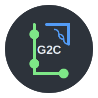

# Git2Context

<p align="center">
  
</p>

Git2Context is a tool that converts GitHub repositories into markdown context files optimized for Large Language Models (LLMs). It helps you create better prompts by providing structured code context from your repositories.

## Demo

Try it out: [https://git2context.vercel.app](https://git2context.vercel.app)

## Features

- 🔄 Convert GitHub repositories into markdown files
- 🔒 Support for both public and private repositories
- 🔍 Smart file filtering based on relevant extensions
- 🎨 Syntax highlighting in the generated markdown
- 🚀 Seamless GitHub OAuth integration
- 💻 Built with Next.js 14 and TypeScript

## Getting Started

### Prerequisites

- Node.js 18.17 or later
- A GitHub account (for accessing private repositories)

### Installation

1. Clone the repository:
```bash
git clone https://github.com/yourusername/git2context.git
cd git2context
```

2. Install dependencies:
```bash
npm install
```

3. Create a GitHub OAuth App:
   - Go to GitHub Settings > Developer Settings > OAuth Apps > New OAuth App
   - Set Homepage URL to `http://localhost:3000` (for development)
   - Set Authorization callback URL to `http://localhost:3000`

4. Create a `.env.local` file:
```env
NEXT_PUBLIC_GITHUB_CLIENT_ID=your_client_id
GITHUB_CLIENT_SECRET=your_client_secret
```

5. Run the development server:
```bash
npm run dev
```

## Usage

1. Visit the application in your browser
2. Enter a GitHub repository URL
3. If it's a private repository, authenticate with GitHub
4. Select the desired branch
5. Click "Generate Markdown" to create the context file

## Supported File Types

### Web Technologies
- JavaScript (`.js`, `.jsx`, `.mjs`)
- TypeScript (`.ts`, `.tsx`)
- HTML (`.html`)
- CSS (`.css`)
- JSON (`.json`)

### Backend
- Python (`.py`, `.pyx`, `.pyi`)
- Ruby (`.rb`)
- PHP (`.php`)
- Java (`.java`)
- Kotlin (`.kt`)
- Go (`.go`)
- Rust (`.rs`)
- C# (`.cs`)
- Swift (`.swift`)

### Systems Programming
- C/C++ (`.c`, `.cpp`, `.h`, `.hpp`)

### Configuration & Documentation
- Markdown (`.md`)
- YAML (`.yaml`, `.yml`)
- TOML (`.toml`)
- INI (`.ini`)
- Environment (`.env`)
- Documentation (`.rst`, `.txt`, `.tex`)

### Data & Query Languages
- SQL (`.sql`)
- GraphQL (`.graphql`)
- Prisma (`.prisma`)

## Deployment

The application can be easily deployed using Vercel:

1. Push your code to GitHub
2. Import your repository in Vercel
3. Add environment variables
4. Update GitHub OAuth App URLs to your production domain

## Contributing

Contributions are welcome! Please feel free to submit a Pull Request.

## License

This project is licensed under the MIT License - see the [LICENSE](LICENSE) file for details.

## Acknowledgments

- Built with [Next.js](https://nextjs.org/)
- UI components from [shadcn/ui](https://ui.shadcn.com)
- Icons by [Lucide](https://lucide.dev)

---

<p align="center">
Made with ❤️ for enhancing LLM interactions
</p>